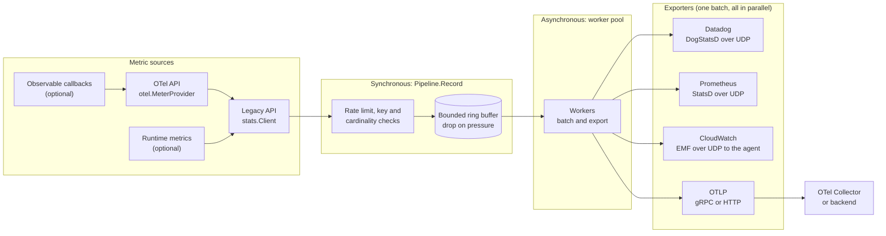

# Stats - High-Performance OpenTelemetry-Compliant Stats Library

A production-ready, non-blocking stats library for Go that implements the **OpenTelemetry Metrics API** and exports to multiple backends (Datadog, Prometheus, CloudWatch, OTLP).

## Features

- ✅ **OpenTelemetry Metrics API**: Sync and observable instruments, dual-mode operation, cumulative OTLP export with explicit-bucket histograms and exemplars ([details and limitations](docs/otel_compliance.md))
- ✅ **Non-Blocking Recording**: Recording never waits for an exporter; when the buffer, memory or rate limit is hit, the observation is dropped and an error is returned
- ✅ **High Performance**: Lock-free ring buffer, >100k events/sec throughput
- ✅ **Multi-Backend**: Datadog (DogStatsD), Prometheus (StatsD), CloudWatch (EMF)
- ✅ **Low Allocation**: Metric objects are pooled to reduce GC pressure (recording is not allocation-free, for example attribute-set handling allocates)
- ✅ **Resilient**: Circuit breakers, panic recovery, graceful degradation
- ✅ **Production Ready**: Memory-bounded, race-detector tested, adaptive backpressure
- ✅ **Dual API**: Simple legacy API + standard OTel API
- ✅ **Runtime Metrics**: Automatic Go CPU, heap, GC, goroutine, memstats-style and (opt-in) process telemetry
- **segmentio/stats parity**: custom exporters (`WithExporter`, `exporters.Multi`, `exporters.Filtered`), context tags, prefixed and tagged sub-clients, `Observe`, `Clock`, `Report`, per-metric histogram buckets, `OTEL_*` environment configuration, Prometheus pull, Datadog events and distributions, and the `httpstats`, `netstats`, `iostats`, `statstest` and `debugstats` packages. See [Migrating from segmentio/stats](#migrating-from-segmentiostats)

## Quick Start

### Simple API (Legacy Mode)

```go
package main

import (
    "context"

    "github.com/convoy-road-trips-app/stats"
)

func main() {
    // Create client
    client, err := stats.NewClient(
        stats.WithServiceName("my-service"),
        stats.WithEnvironment("production"),
        stats.WithDatadog(&stats.DatadogConfig{
            AgentHost: "localhost",
            AgentPort: 8125,
        }),
    )
    if err != nil {
        panic(err)
    }
    defer client.Close()

    // Record metrics - never blocks!
    ctx := context.Background()
    client.Counter(ctx, "http.requests", 1.0,
        stats.WithAttribute("method", "GET"),
        stats.WithAttribute("status", "200"),
    )

    client.Gauge(ctx, "memory.usage", 75.5,
        stats.WithAttribute("unit", "percent"),
    )

    client.Histogram(ctx, "response.time", 0.145,
        stats.WithAttribute("endpoint", "/api/users"),
    )
}
```

### OpenTelemetry API (OTel Mode)

```go
package main

import (
    "context"
    
    "go.opentelemetry.io/otel/attribute"
    "go.opentelemetry.io/otel/metric"
    
    "github.com/convoy-road-trips-app/stats"
    "github.com/convoy-road-trips-app/stats/otel"
)

func main() {
    // Create OTel-compliant MeterProvider
    provider, err := otel.NewMeterProvider(
        otel.WithStatsOptions(
            stats.WithServiceName("my-service"),
            stats.WithEnvironment("production"),
            stats.WithDatadog(&stats.DatadogConfig{
                AgentHost: "localhost",
                AgentPort: 8125,
            }),
        ),
    )
    if err != nil {
        panic(err)
    }
    defer provider.Shutdown(context.Background())

    // Use standard OTel API
    meter := provider.Meter("my-app")
    
    // Create instruments
    counter, _ := meter.Int64Counter("http.requests")
    histogram, _ := meter.Float64Histogram("response.time")
    gauge, _ := meter.Float64Gauge("memory.usage")

    // Record metrics
    ctx := context.Background()
    counter.Add(ctx, 1, metric.WithAttributes(
        attribute.String("method", "GET"),
        attribute.String("status", "200"),
    ))
    
    histogram.Record(ctx, 145.3, metric.WithAttributes(
        attribute.String("endpoint", "/api/users"),
    ))
    
    gauge.Record(ctx, 75.5, metric.WithAttributes(
        attribute.String("unit", "percent"),
    ))
}
```

**Both modes share the same high-performance pipeline!** See [docs/otel_compliance.md](docs/otel_compliance.md) for details.

## Installation

```bash
go get github.com/convoy-road-trips-app/stats@v1.2.2
```

Usage, flush/shutdown and an options reference: **[docs/usage.md](docs/usage.md)**. A runnable collector + Prometheus stack: [examples/docker](examples/docker/README.md).

### Upgrading from v1.0.x (SemVer exception)

v1.1.0 only adds Go API, but it changes behavior that v1.0.x code can observe, and is released as a minor version on purpose (v2 would need a `/v2` module path):

- OTLP sums and histograms are **cumulative by default**; use `stats.WithTemporality(stats.Delta)` for the old delta export.
- **Malformed attribute keys are rejected** (`ErrInvalidTagKey`).
- **Cardinality limits** apply: 10 attributes per observation, 256-rune values, 2000 series per metric.
- `Shutdown`/`Close` **drain** buffered metrics before returning.

Pin `v1.0.1` if you need the previous behavior. Details: [CHANGELOG](CHANGELOG.md) and [docs/otel_compliance.md](docs/otel_compliance.md#limitations).

## Configuration

### Basic Configuration

```go
client, err := stats.NewClient(
    // Service identification
    stats.WithServiceName("my-service"),
    stats.WithEnvironment("production"),

    // Performance tuning
    stats.WithBufferSize(16384),        // Ring buffer capacity (default: 16384)
    stats.WithWorkers(4),                // Worker goroutines (default: 4)
    stats.WithFlushInterval(100*time.Millisecond),

    // Memory limits
    stats.WithMaxMemoryBytes(10 * 1024 * 1024), // 10MB

    // Backpressure handling
    stats.WithDropStrategy(stats.DropOldest),   // Drop oldest on overflow
    stats.WithAdaptiveBatching(true),           // Increase batch size under load
)
```

### Backend Configuration

#### Datadog (DogStatsD)

```go
stats.WithDatadog(&stats.DatadogConfig{
    AgentHost: "localhost",
    AgentPort: 8125,
    Tags:      []string{"env:prod", "version:1.0"},
})
```

Optional fields (all in `stats.DatadogConfig`):

| Field | Default | Behavior |
|---|---|---|
| `Endpoint` | empty | Overrides `AgentHost`/`AgentPort`. Accepts `host:port`, `udp://host:port` and `unixgram:///abs/path` (Unix datagram socket, not on Windows) |
| `BufferSize` | 1432 (UDP), 8192 (unixgram) | Largest datagram in bytes, up to 65507. Whole lines are batched into datagrams and never split; a single line larger than `BufferSize` is dropped and counted as an export error |
| `UseDistributions` | false | Send every histogram as a Datadog distribution (`\|d`) instead of a histogram (`\|h`) |
| `DistributionPrefixes` | none | Send histograms whose full metric name starts with one of these prefixes as distributions. `UseDistributions` wins when set. Segmentio matched individual field names; here the whole metric name is matched |
| `Filters` | `["http_req_path"]` | Tag keys stripped from every metric, from attributes and from `Tags`. A nil slice selects the default, an empty non-nil slice keeps every tag |

```go
stats.WithDatadog(&stats.DatadogConfig{
    Endpoint:             "unixgram:///var/run/datadog/dsd.socket",
    BufferSize:           8192,
    DistributionPrefixes: []string{"http."},
    Filters:              []string{"http_req_path", "user_agent"},
})
```

Send a Datadog event straight over the same connection, outside the metric buffer:

```go
err := client.Event(ctx, stats.DatadogEvent{
    Title:     "deploy finished",
    Text:      "v2.4.1 rolled out",
    Priority:  stats.EventPriorityNormal,
    AlertType: stats.EventAlertTypeSuccess,
    Tags:      []attribute.KeyValue{attribute.String("region", "eu")},
})
```

`Event` blocks for at most the UDP timeout. It returns `stats.ErrDatadogNotConfigured` without a Datadog backend, `stats.ErrEventTooLarge` above `BufferSize`, and `stats.ErrClientClosed` after the root client is closed. Failures are counted in `ClientStats.EventsDropped`. The optional `stats.EventSender` interface lets code that holds a `stats.Recorder` check for support.

#### Prometheus (StatsD push)

```go
stats.WithPrometheus(&stats.PrometheusConfig{
    Host:   "localhost",
    Port:   9125,
    Prefix: "myapp",
})
```

This pushes StatsD lines over UDP to a StatsD exporter that Prometheus scrapes.

#### Prometheus (pull)

To expose a scrape endpoint from your own process, give the client a `prometheus.Handler`. The client folds every metric into it, and a scrape renders the current state in the text exposition format:

```go
import "github.com/convoy-road-trips-app/stats/exporters/prometheus"

h := &prometheus.Handler{}
client, err := stats.NewClient(stats.WithPrometheusHandler(h))
// ...
http.Handle("/metrics", h)
```

Push and pull differ in who holds the state:

| | Push (`WithPrometheus`) | Pull (`WithPrometheusHandler`) |
|---|---|---|
| Transport | StatsD over UDP to a StatsD exporter | `http.Handler` served by your process |
| State | In the StatsD exporter | Cumulative, in memory in this process |
| Counters | Increments sent as they happen | Accumulated and exposed as `<name>_total` |
| Histograms | StatsD timers, bucketed by the StatsD exporter | `_bucket`/`_sum`/`_count` with the client's bucket bounds |
| Idle series | Handled by the StatsD exporter | Dropped after `Handler.MetricTimeout` (default 2 minutes) without an update |

Metrics reach the handler asynchronously, so call `client.Flush(ctx)` before scraping in tests. `Handler.TrimPrefix` removes a prefix from metric names, and `Handler.Buckets` overrides the histogram bounds (by default it follows `WithHistogramBucketsFor` and `WithHistogramBuckets`). Both exporters can be registered on one client; they report as `prometheus` and `prometheus-pull` in `ExporterErrors`. A scrape accepts `GET` and `HEAD` only and gzip-compresses when the request asks for it.

#### CloudWatch (EMF)

```go
stats.WithCloudWatch(&stats.CloudWatchConfig{
    LogGroupName:  "/aws/ecs/my-service",
    Namespace:     "MyApp/Metrics",
    FlushInterval: 60 * time.Second,
})
```

#### OTLP (gRPC)

```go
stats.WithOTLP(&stats.OTLPConfig{
    Endpoint:    "localhost:4317",
    Insecure:    true,
    ServiceName: "my-service",
    Headers:     map[string]string{"Authorization": "Bearer token"},
})
```

#### OTLP (HTTP)

```go
stats.WithOTLP(&stats.OTLPConfig{
    Endpoint:    "localhost:4318",
    Insecure:    true,
    ServiceName: "my-service",
    Protocol:    stats.OTLPProtocolHTTP,
})
```

When `Enabled` is false (or the config is omitted), no connection is established and the exporter is a no-op. `Protocol` defaults to `"grpc"` if unset.

OTLP export semantics (v1.1.0):

- Counters and histograms are **cumulative** by default (`stats.WithTemporality(stats.Delta)` opts out; Prometheus' OTLP receiver drops delta series).
- Histograms use explicit buckets: by default the D9 seconds bounds `0.005 … 10`, overridable with `stats.WithHistogramBuckets(...)`. In Prometheus they appear as `_bucket{le=...}`, `_count` and `_sum`.
- `service.name`, `deployment.environment` and `service.version` come from options, `OTEL_SERVICE_NAME` / `DEPLOYMENT_ENVIRONMENT` / `SERVICE_VERSION`, or `OTEL_RESOURCE_ATTRIBUTES`.
- `service.instance.id` defaults to the hostname so replicas export distinct series (the `instance` label in Prometheus-compatible backends); override it with `OTEL_RESOURCE_ATTRIBUTES` or `WithOTLPResourceAttributes`.
- The resource schema URL comes from `otel.WithResource` or `stats.WithOTLPResourceSchemaURL`. Metric description and unit are exported for observable instruments and for `stats.WithDescription` / `stats.WithUnit`.
- Counter and histogram observations recorded under a sampled span carry `trace_id`/`span_id` exemplars.
- `stats.WithOTLPRetry(...)` retries retryable failures. Background exports are bounded by `WithUDPTimeout` (100 ms default); raise it for remote collectors.
- `stats.WithOTLPFromEnv()` enables OTLP and reads its settings from the standard `OTEL_EXPORTER_OTLP_*` variables, see [Environment variables](#environment-variables).
- `stats.WithOTLPExportInterval(d)` and `stats.WithOTLPExportTimeout(d)` set how often and how long OTLP exports run.
- `stats.WithExponentialHistogram(maxSize, maxScale)` exports histograms as base-2 exponential histograms, see [Histograms](#histograms).

#### Attribute and cardinality limits (all backends)

- Attribute keys must be identifier segments joined by single dots, `^[a-zA-Z_][a-zA-Z0-9_]*(\.[a-zA-Z_][a-zA-Z0-9_]*)*$`, so OTel semantic-convention keys such as `http.method` are accepted unchanged. Other keys (`bad..key`, `http-method`) reject the observation with `stats.ErrInvalidTagKey`.
- Values are capped at 256 runes, and only the first 10 keys in lexical order are kept.
- At most 2000 attribute sets per metric name by default (`stats.WithMaxCardinality`); new series beyond that return `stats.ErrCardinalityLimit`.
- Drops are counted in `telemetry_dropped_labels_total{reason}`.

#### Flush and shutdown

`client.Flush(ctx)` and `provider.ForceFlush(ctx)` export everything buffered with the caller's context; `Shutdown(ctx)` drains the buffer before returning. Use them at the end of each AWS Lambda invocation. A `stats.Recorder` has no `Flush`, so existing implementations keep compiling; `*Client` and `*NoOpClient` implement the separate `stats.Flusher` interface, so use `if f, ok := recorder.(stats.Flusher); ok { err = f.Flush(ctx) }`.

#### Histograms

Explicit buckets are the default. Their bounds are in the unit you record in:

```go
client, err := stats.NewClient(
    stats.WithHistogramBuckets([]float64{0.01, 0.1, 1, 10}),        // every histogram
    stats.WithHistogramBucketsFor("db.query", 0.001, 0.01, 0.1, 1), // one metric name
)
```

`WithHistogramBucketsFor(name, bounds...)` overrides the global bounds for one metric name. Bounds must be non-empty, finite and strictly increasing, and are copied. The OTLP exporter and the Prometheus pull handler use the same lookup, so both expose the same `le` bounds.

For OTLP you can export base-2 exponential histograms instead:

```go
stats.WithExponentialHistogram(160, 20)
```

- Every series starts at scale `maxScale` (range -10 to 20) and is downscaled when its values need more than `maxSize` buckets (at least 2) in the positive or the negative range.
- A zero argument selects its default, 160 buckets and scale 20, as in the OTel SDK. Scale 0 itself therefore cannot be chosen. Other out-of-range values make `NewClient` return `stats.ErrInvalidConfig`.
- A metric with its own bounds from `WithHistogramBucketsFor` keeps those explicit buckets. `WithHistogramBuckets` then applies to no metric.
- Only OTLP is affected. Other exporters keep their own histogram handling.

#### Custom exporters

Register any `stats.Exporter` (an alias of `models.Exporter`: `Name`, `Export`, `Shutdown`) next to the built-in backends:

```go
client, err := stats.NewClient(stats.WithExporter(myExporter))
```

It runs in parallel with the built-in exporters, gets its own entry in `ExporterErrors` under its `Name()`, and is shut down on `Close`. `NewClient` returns `stats.ErrInvalidConfig` for a nil exporter or a name that another exporter already uses. Batches are shared between exporters, so an exporter must never modify the metrics it receives.

Two helpers in `exporters` compose exporters:

```go
import "github.com/convoy-road-trips-app/stats/exporters"

// Fan out to several exporters under one name, each bounded on its own.
multi := exporters.Multi("fanout", 100*time.Millisecond, a, b)

// Pass only a subset of each batch to an exporter. The filter must return
// a subset of its input or copies; it must not modify the metrics.
errorsOnly := exporters.Filtered(b, func(batch []*models.Metric) []*models.Metric {
    kept := batch[:0:0]
    for _, m := range batch {
        if strings.HasPrefix(m.Name, "errors.") {
            kept = append(kept, m)
        }
    }
    return kept
})
```

`Multi` recovers a panic in one child and reports it as that child's error, and joins child errors with `errors.Join`. `Filtered` skips `Export` when the filter returns an empty batch.

#### Environment variables

`OTEL_*` variables only fill in configuration. They never enable OTLP by themselves: use `stats.WithOTLP(...)` or `stats.WithOTLPFromEnv()` (or `otel.NewMeterProviderFromEnv()` in OTel mode).

**Precedence: explicit options win over environment variables, which win over defaults.** For the `OTEL_EXPORTER_OTLP_METRICS_*` variables, the metrics-specific one wins over the generic `OTEL_EXPORTER_OTLP_*` one.

The supported variables are listed in [docs/usage.md](docs/usage.md#environment-variables). A malformed value of a supported variable makes `NewClient` return `stats.ErrInvalidConfig`, naming the variable. Unsupported variables have no effect.

#### Version metrics and disabling

- On the first successful record, a root client also records the gauges `stats_version` and `go_version` (value 1, the version in an attribute of the same name, tagged with service and environment only). This adds two series per process. Turn it off with `stats.WithVersionReporting(false)` or `STATS_DISABLE_GO_VERSION_REPORTING=true|TRUE|yes|1`. The option wins over the environment.
- `OTEL_SDK_DISABLED=true` (case-insensitive) makes `NewClient` and `otel.NewMeterProvider` start nothing and dial nothing. Every recording method returns nil, `Flush`/`Shutdown`/`Close` return nil, and `client.Disabled()` reports the state.

#### Runtime Metrics (Go CPU + Heap)

Enable automatic Go runtime telemetry with a single option:

```go
// Legacy Mode
client, err := stats.NewClient(
    stats.WithServiceName("my-service"),
    stats.WithRuntimeMetrics(), // collects every 10s, prefix "runtime.go"
)

// OTel Mode
provider, err := otel.NewMeterProvider(
    otel.WithStatsOptions(
        stats.WithServiceName("my-service"),
        stats.WithRuntimeMetrics(),
    ),
)
```

**Collected metrics** (prefix `runtime.go.`):

| Group | Example Metrics |
|-------|----------------|
| Memory | `memory.heap.alloc`, `memory.heap.inuse`, `memory.sys`, `memory.stack.sys`, `memory.mspan.sys` |
| Heap | `heap.allocs.bytes`, `heap.objects.live`, `heap.goal.bytes` |
| GC | `gc.cycles.total`, `gc.cpu.seconds`, `gc.cpu.fraction`, `gc.pause.seconds.max` |
| Scheduler | `goroutines`, `gomaxprocs`, `cgo.calls` |
| CPU time | `cpu.total.seconds`, `cpu.user.seconds`, `cpu.idle.seconds` |

All values are emitted as absolute gauges. `stats.WithRuntimeProcessMetrics()` (implies `WithRuntimeMetrics()`) adds process metrics (CPU, memory, page faults, open files, threads, context switches) on Linux and Darwin. See [docs/runtime_metrics.md](docs/runtime_metrics.md) for the full metric list, semantics, and how to compute rates in your backend.

## Architecture

Both APIs record into one shared pipeline. Recording is synchronous and bounded; export is asynchronous. Detailed diagrams of the recording path, exporter fan-out and Flush/Shutdown lifecycle are in [docs/architecture.md](docs/architecture.md).



### Key Components

- **Ring Buffer**: Bounded queue using atomic operations and per-slot sequence numbers
- **Worker Pool**: Parallel metric processing with configurable workers
- **Exporters**: Backend-specific serialization and transport
- **Circuit Breaker**: Used by the UDP exporters (Datadog, Prometheus, CloudWatch) to stop sending after repeated failures
- **UDP Pool**: Pre-created UDP connections shared by the UDP exporters

## Performance

| Metric | Target | Actual |
|--------|--------|--------|
| Push latency (p99) | <100ns | ~25ns |
| End-to-end (p99) | <100ms | <50ms |
| Throughput | >100k/sec | >200k/sec |
| Memory usage | <10MB | ~5MB |
| Drop rate | <1% | <0.1% |
| OTel overhead | - | +13% (~3ns) |

### Benchmarks

```
BenchmarkRingBuffer/Push-8           50000000    25.3 ns/op    0 B/op    0 allocs/op
BenchmarkRingBuffer/Pop-8            50000000    28.7 ns/op    0 B/op    0 allocs/op
BenchmarkOTelMode/Counter-8          45000000    28.7 ns/op    0 B/op    0 allocs/op
```

See [docs/performance_guide.md](docs/performance_guide.md) for detailed performance analysis.

## API Reference

### Legacy API

#### Recording Metrics

```go
// Counter - monotonically increasing value
client.Counter(ctx, "requests.total", 1.0)
client.Increment(ctx, "page.views")
client.IncrementBy(ctx, "bytes.sent", 1024.0)

// Gauge - point-in-time value
client.Gauge(ctx, "cpu.usage", 45.2)

// Histogram - statistical distribution
client.Histogram(ctx, "request.duration", 0.1234) // seconds, matches the default buckets
client.Timing(ctx, "db.query", duration)          // records milliseconds
client.Observe(ctx, "db.query.duration", duration) // records seconds, matches the default buckets
```

**Observe versus Timing.** `Observe(ctx, name, d time.Duration, opts...)` records `d.Seconds()` into a histogram, the unit OpenTelemetry semantic conventions and Prometheus use for durations and the unit of the default buckets. `Timing` is unchanged and still records milliseconds, so existing dashboards keep their values. Prefer `Observe` for new code. `Observe` is not part of `stats.Recorder`; `*Client` and `*NoOpClient` implement the optional `stats.DurationObserver` interface, so code that holds a `Recorder` can use `if o, ok := rec.(stats.DurationObserver); ok { _ = o.Observe(ctx, name, d) }`.

#### With Attributes

```go
client.Counter(ctx, "http.requests", 1.0,
    stats.WithAttribute("method", "POST"),
    stats.WithAttribute("status", "201"),
    stats.WithAttribute("endpoint", "/api/users"),
)
```

#### Sub-clients: prefixes and tags

`WithPrefix` and `WithTags` return a view of the client. A view shares the parent's pipeline: it prepends a name prefix and adds tags to everything recorded through it.

```go
api := client.WithPrefix("api").WithTags(stats.WithAttribute("region", "eu"))
api.Counter(ctx, "requests", 1)  // recorded as "api.requests" with region=eu
v1 := api.WithPrefix("v1")       // "api.v1.requests"
```

Prefix parts are joined with `.` and empty parts are skipped. View tags come first and a later tag wins over an earlier one with the same key, so a child's tag overrides its parent's. Views are immutable and safe for concurrent use. `Close` and `Shutdown` on a view do nothing and return nil, while `Flush` and `Stats` act on the root. Recording through a view fails with `stats.ErrClientClosed` once the root is closed. `*NoOpClient` has the same two methods.

#### Context tags

Attach tags to a `context.Context` and every metric recorded with it carries them:

```go
ctx = stats.ContextWithTags(ctx, attribute.String("tenant.tier", "gold"))
client.Counter(ctx, "orders", 1)

stats.ContextAddTags(ctx, attribute.String("region", "eu")) // in place, visible to derived contexts
tags := stats.ContextTags(ctx)                                // a copy
```

`ContextWithTags` replaces tags the context already carried, so pass `ContextTags(ctx)` along with the new ones to keep them. `ContextAddTags` returns false when the context has no tag set (it was not made by `ContextWithTags`). Order of application: view tags, then context tags, then the metric's own attributes and explicit options, so an explicit option wins on a duplicate key.

> **Cardinality warning.** Context tags become series dimensions, subject to the same key validation (`ErrInvalidTagKey`) and limits (10 attributes, 256-rune values, 2000 series per metric) as option tags. Use low-cardinality values such as a region, tenant tier or route template. **Never put request IDs, user IDs or other unbounded values in context tags.**

#### Report

`stats.Report` records a struct (or a slice or array of structs) described by struct tags, through any `stats.Recorder`:

```go
type RequestStats struct {
    Route   string        `tag:"route"`
    Count   int           `metric:"requests" type:"counter"`
    Latency time.Duration `metric:"latency"` // histogram by default, reported in seconds
    Cache   struct {
        Hits int `metric:"hits" type:"counter"`
    } `metric:"cache"` // cache.hits
}

err := stats.Report(ctx, client, &RequestStats{Route: "/users/{id}", Count: 1})
err = stats.ReportAt(ctx, client, time.Now(), &RequestStats{Route: "/health"})
```

`metric:"name"` names a value field, or prefixes the metrics of a nested struct. `type:"counter|gauge|histogram"` picks the type (histogram by default). `tag:"key"` on a string field becomes an attribute on the metrics of its struct and of nested structs, and an empty value is never attached. Values may be bool (0 or 1), any int, uint or float width, `uintptr`, or `time.Duration` (in seconds). They are recorded as `float64`, so integers are exact up to 2^53. A field with a `metric` or `tag` struct tag of an unsupported kind makes `Report` return an error wrapping `stats.ErrUnsupportedReportField` before anything is recorded. `ReportAt` stamps every metric with the given time. Both go through the recorder's `Counter`, `Gauge` and `Histogram`, so prefixes and context tags apply.

#### Clock

A `stats.Clock` times the steps of one sequential operation as a single histogram in seconds, with a `stamp` attribute naming the step:

```go
clock := client.Clock("job.duration")   // started now
// ... load ...
clock.Stamp(ctx, "load")                // time since the clock started
// ... store ...
clock.Stamp(ctx, "store")               // time since the previous Stamp
clock.Stop(ctx)                         // time since the start, stamp="total"
```

`stats.NewClock(recorder, name, opts...)` works with any `stats.Recorder`, and `StampAt`, `StopAt` and `NewClockAt` take an explicit time. A clock is not safe for concurrent use, and every distinct step name is a new series, so use constant names. In OTel mode, `otel.NewClock(histogram, opts...)` does the same for any `metric.Float64Histogram`.

#### Statistics

```go
clientStats := client.Stats()
fmt.Printf("Processed: %d\n", clientStats.Pipeline.Processed)
fmt.Printf("Dropped: %d\n", clientStats.Pipeline.Dropped)
fmt.Printf("Errors: %d\n", clientStats.Pipeline.Errors)
fmt.Printf("Buffer Length: %d\n", clientStats.Pipeline.BufferLength)
fmt.Printf("Exporter Errors: %v\n", clientStats.Pipeline.ExporterErrors)
fmt.Printf("Datadog events dropped: %d\n", clientStats.EventsDropped)
```

### OpenTelemetry API

#### Supported Instruments

| Instrument | Description | Example Use Case |
|------------|-------------|------------------|
| `Int64Counter` | Monotonically increasing integer | Request counts |
| `Float64Counter` | Monotonically increasing float | Fractional increments |
| `Int64UpDownCounter` | Can increase/decrease (exported as a gauge of the latest increment) | Active connections |
| `Float64UpDownCounter` | Can increase/decrease (exported as a gauge of the latest increment) | Temperature |
| `Int64Histogram` | Distribution of integers | Response sizes |
| `Float64Histogram` | Distribution of floats | Request durations |
| `Int64Gauge` | Point-in-time integer | CPU cores |
| `Float64Gauge` | Point-in-time float | CPU percentage |
| `Int64/Float64ObservableCounter` | Callback-reported cumulative total | Bytes read since start |
| `Int64/Float64ObservableUpDownCounter` | Callback-reported value, exported as a gauge | Queue depth |
| `Int64/Float64ObservableGauge` | Callback-reported point-in-time value | Pool utilization |

#### Creating Instruments

```go
meter := provider.Meter("my-app")

counter, _ := meter.Int64Counter("requests",
    metric.WithDescription("Total requests"),
    metric.WithUnit("{request}"),
)

histogram, _ := meter.Float64Histogram("duration",
    metric.WithDescription("Request duration"),
    metric.WithUnit("ms"),
)

gauge, _ := meter.Float64Gauge("memory",
    metric.WithDescription("Memory usage"),
    metric.WithUnit("By"),
)
```

OTLP exports the description and unit of observable instruments; synchronous instruments accept them but do not export them yet.

`otel.NewMeterProviderFromEnv(opts...)` is `NewMeterProvider` with `stats.WithOTLPFromEnv()` prepended: OTLP is enabled and configured from the `OTEL_EXPORTER_OTLP_*` variables, and `OTEL_SDK_DISABLED=true` turns every instrument into a no-op. Options in `opts` apply afterwards and win over the environment.

Values are carried as `float64`, so `Int64*` instruments are exported as OTLP double points and are exact only up to 2^53.

See [docs/otel_compliance.md](docs/otel_compliance.md) for complete OTel documentation.

## Instrumentation packages

These packages import only `stats`, `models` and `exporters`, and record to any `stats.Recorder`. Each has a `...With` variant taking the recorder explicitly. `httpstats` and `netstats` also have package-level constructors (`NewHandler`, `NewTransport`, `NewConn`, ...) that record to a default recorder set with `SetDefaultRecorder`; until it is set they record nothing.

### httpstats

```go
import "github.com/convoy-road-trips-app/stats/httpstats"

srv := &http.Server{Handler: httpstats.NewHandlerWith(client, mux)}
hc := &http.Client{Transport: httpstats.NewTransportWith(client, nil)} // nil means http.DefaultTransport

// Add low-cardinality tags to every metric of one request.
req = httpstats.RequestWithTags(req, attribute.String("tenant.tier", "gold"))
tags := httpstats.RequestTags(req)
```

- The handler records `http.server.request.duration` (seconds), `http.server.request.body.size`, `http.server.response.body.size` (bytes) and the gauge `http.server.active_requests`.
- The transport records `http.client.request.duration` (seconds, until the response body is closed or read to EOF, so always close the body), `http.client.request.body.size` and `http.client.response.body.size`.
- Attributes follow the OTel semantic conventions: `http.request.method` (`_OTHER` for unknown methods), `http.response.status_code`, `url.scheme`, `network.protocol.version`, `server.address`/`server.port` (client), `error.type` (status 500 or higher, or the Go error type on the client).
- `http.route` holds only the matched route template (the `http.ServeMux` pattern without its method) and is left out when no pattern matched. `url.path`, `url.full` and raw request paths are never recorded.
- A panic in the wrapped handler is recorded as status 500 and then continues.

### netstats

```go
import "github.com/convoy-road-trips-app/stats/netstats"

ln = netstats.NewListenerWith(client, ln, netstats.WithZones("us-east-1a", "us-east-1b"))
conn = netstats.NewConnWith(client, conn)
h := netstats.NewHandlerWith(client, myHandler) // myHandler implements netstats.Handler (ServeConn)
```

Metrics use the segmentio names: `conn.open.count`, `conn.close.count`, `conn.read.count`, `conn.write.count`, `conn.read.bytes`, `conn.write.bytes` and `conn.error.count` (with an `operation` tag of `read`, `write`, `close` or `accept`). Every metric carries `protocol`, `source_zone`, `target_zone` and `in_zone`. Zones come from `WithZones` or, for a `Handler`, from `source_zone` and `target_zone` context tags; they become series dimensions, so use a small fixed set.

**Difference from segmentio:** segmentio records a metric on every `Read` and `Write`. Doing that here would flood the pipeline, so each connection counts reads and writes in local atomics and flushes them as `conn.read.count`, `conn.write.count` and one `conn.read.bytes` and `conn.write.bytes` observation when the connection closes, and otherwise every 10 seconds (`netstats.WithFlushInterval`). Totals are visible with a delay of up to that interval, and one byte histogram observation is a per-flush total, not a per-call size. Always close wrapped connections: closing is what flushes them and stops their timer.

### iostats

`iostats.CountReader{R: r}` and `iostats.CountWriter{W: w}` count the bytes that pass through in their `N` field. `iostats.ReaderFunc`, `iostats.WriterFunc` and `iostats.CloserFunc` adapt functions to `io.Reader`, `io.Writer` and `io.Closer`.

### statstest and debugstats

```go
import "github.com/convoy-road-trips-app/stats/statstest"

func TestCheckout(t *testing.T) {
    client, capture := statstest.NewClient(t)
    _ = client.Counter(ctx, "orders", 1)
    statstest.Flush(t, client)
    metrics := capture.Metrics() // deep copies; capture.Clear(), capture.FlushCalls() also exist
}
```

- `statstest.NewClient(t, opts...)` returns a client wired to a `statstest.Exporter` and closes it with the test. Version reporting is off by default there.
- `statstest.NewDogStatsDServer(t, handler)` starts a DogStatsD UDP server on a free local port and returns its address for `DatadogConfig.Endpoint`; `statstest.DogStatsDServer` (`ListenAndServe`, `Serve`) and the function forms `ListenAndServeDogStatsD` and `ServeDogStatsD` serve any address, including `unixgram://`. The handler (`DogStatsDHandler`, or a `DogStatsDHandlerFunc`) receives parsed `DogStatsDMetric` and `DogStatsDEvent` values.
- `debugstats.Exporter{Dst: os.Stdout, Grep: re}` prints every metric as one StatsD-format line, optionally only those matching `Grep`. Register it with `stats.WithExporter` to see what an application emits.

## Testing

### Using Makefile

```bash
# Run all tests
make test

# Run with race detector
make test-race

# Run benchmarks
make bench

# Run linter
make lint

# OTLP -> collector -> Prometheus integration tests against grafana/otel-lgtm (requires Docker)
make lgtm-test

# Build
make build

# Clean
make clean
```

### Manual Testing

```bash
# Run all tests
go test ./...

# Run with race detector
go test -race ./...

# Run benchmarks
go test -bench=. ./transport/...

# Run examples
go run examples/basic/main.go
go run examples/otel/main.go
go run examples/multibackend/main.go
go run ./examples/clock
```

## Testing & Mocking

The library provides a `Recorder` interface and a `NoOpClient` to facilitate testing your application without sending real metrics.

### Using the Recorder Interface

Instead of depending on the concrete `*stats.Client`, your services should depend on the `stats.Recorder` interface:

```go
type MyService struct {
    stats stats.Recorder
}

func NewMyService(s stats.Recorder) *MyService {
    return &MyService{stats: s}
}
```

### Mocking in Tests

In your unit tests, you can use `stats.NewNoOpClient()` which implements the `Recorder` interface but performs no operations:

```go
func TestMyService(t *testing.T) {
    // Non-blocking no-op client for testing
    mockStats := stats.NewNoOpClient()
    svc := NewMyService(mockStats)

    // Run your tests...
}
```

For assertions on what was recorded, use `statstest.NewClient` (see [statstest and debugstats](#statstest-and-debugstats)). See [examples/testing/](examples/testing/) for a complete example.

## Migrating from segmentio/stats

This library ports the features of [segmentio/stats](https://github.com/segmentio/stats) v5.11.0 that are listed in the tables below, and the "Not ported" rows name what it leaves out. It is not a drop-in replacement: the shapes differ in a few ways that follow from the OpenTelemetry data model:

- Recording methods take a `context.Context` first and return an `error` (a dropped observation is reported, never blocks).
- Tags are `stats.WithAttribute(k, v)` options or `attribute.KeyValue` values, and keys must be dotted identifier segments (`ErrInvalidTagKey` otherwise).
- Backends are options of `stats.NewClient` rather than handlers on an engine.

| segmentio/stats | This library |
|---|---|
| `Engine.Observe` (durations in seconds) | `(*Client).Observe(ctx, name, time.Duration, ...MetricOption) error` and the `stats.DurationObserver` interface. `Timing` is unchanged and records milliseconds |
| `Engine.WithPrefix`, `Engine.WithTags` | `(*Client).WithPrefix(prefix, opts...)`, `(*Client).WithTags(opts...)`: views that share the pipeline, `Close` on a view does nothing |
| `ContextWithTags`, `ContextAddTags`, `ContextTags` | Same names in package `stats`, using `[]attribute.KeyValue` |
| `Report`, `ReportAt` | `stats.Report(ctx, recorder, v, opts...)`, `stats.ReportAt(ctx, recorder, t, v, opts...)`; `Report` records directly, see the `MakeMeasures` row below |
| `Value` types (int, uint, bool, duration) | Accepted by `Report`, converted to `float64` (exact up to 2^53) |
| `Buckets`, `SetBuckets` | `stats.WithHistogramBucketsFor(name, bounds...)` and `stats.WithHistogramBuckets(bounds)` |
| `Clock` | `(*Client).Clock(name, opts...)`, `stats.NewClock`, `Stamp`/`Stop` (and `otel.NewClock` for OTel histograms) |
| `go_version` and `stats_version` metrics | `stats_version` and `go_version` gauges with value 1; `stats.WithVersionReporting(bool)`; `STATS_DISABLE_GO_VERSION_REPORTING` (the value `on` is not accepted, see below) |
| `MultiHandler`, `FilteredHandler`, custom `Handler` | `stats.WithExporter(Exporter)`, `exporters.Multi(name, timeout, ...)`, `exporters.Filtered(e, filter)` |
| `httpstats` | `httpstats.NewHandler`, `NewHandlerWith`, `NewTransport`, `NewTransportWith`, `RequestWithTags`, `RequestTags`; standard OTel metric names, with fewer measurements, see [Adapted and not ported](#adapted-and-not-ported) |
| `netstats` | `netstats.NewConn`, `NewConnWith`, `NewListener`, `NewListenerWith`, `NewHandler`, `NewHandlerWith` and the `Handler` interface; totals are flushed in batches, see [netstats](#netstats) and [Adapted and not ported](#adapted-and-not-ported) |
| `iostats` | `iostats.CountReader`, `CountWriter`, `ReaderFunc`, `WriterFunc`, `CloserFunc` |
| `procstats` Go and Proc metrics | `stats.WithRuntimeMetrics()` (memstats-style) and `stats.WithRuntimeProcessMetrics()` (Linux and Darwin), a subset of the segmentio measurements, see [Adapted and not ported](#adapted-and-not-ported) and [docs/runtime_metrics.md](docs/runtime_metrics.md) |
| `procstats` Delay metrics | Linux taskstats, see [docs/runtime_metrics.md](docs/runtime_metrics.md#delay-metrics-linux-opt-in) |
| `statstest` | `statstest.Exporter` (captures metrics, `Clear`, `FlushCalls`) and `statstest.DogStatsDServer` (from `datadog.ListenAndServe` and `Serve`) |
| `debugstats` | `debugstats.Exporter{Dst io.Writer, Grep *regexp.Regexp}` |
| `datadog` | `stats.WithDatadog` with `Endpoint` (`udp://`, `unixgram://`), `BufferSize` (max 65507), `Filters` (default `http_req_path`), `UseDistributions`, `DistributionPrefixes`, and `(*Client).Event(ctx, DatadogEvent)` |
| `prometheus` (pull handler) | `prometheus.Handler` (an `http.Handler`) and `stats.WithPrometheusHandler(h)` |
| `otlp` `SDKConfig` | `OTEL_*` environment configuration, `stats.WithOTLPFromEnv()`, `stats.WithOTLPExportInterval`, `stats.WithOTLPExportTimeout`, `stats.WithExponentialHistogram(maxSize, maxScale)`; no TLS, client or resource customization, see [Adapted and not ported](#adapted-and-not-ported) |
| `influxdb`, `veneur`, the deprecated custom `otlp.Handler` | Not ported |

### Adapted and not ported

Everything else in segmentio/stats v5.11.0 is listed here. "Mapped" means a usable counterpart exists, not that the signature is the same. "Adapted" means the feature exists with a different behavior. "Not ported" means there is no counterpart.

| segmentio/stats | Status | This library |
|---|---|---|
| `Engine.Incr`, `Add`, `Set`, `Observe(value)` | Mapped | `Increment`, `IncrementBy`, `Counter`, `Gauge` and `Histogram` on `*Client` (context first, error returned). Numeric `Observe(value)` is `Histogram`; `Client.Observe` takes only a `time.Duration` |
| `IncrAt`, `AddAt`, `SetAt`, `ObserveAt` | Mapped | The same methods with `stats.WithTimestamp(t)`; `ReportAt` for structs |
| `Tag`, `T`, `M` | Mapped | `attribute.KeyValue` values, `stats.WithAttribute(key, value)` and `stats.WithAttributes(map[string]string)` |
| Duplicate tag keys with different values (`AllowDuplicateTags`) | Adapted | Duplicate keys collapse and the later value wins, so the same key cannot be sent twice with different values |
| `DefaultEngine`, package-level `stats.Incr` and friends, `Register` | Not ported | Create a `*Client` and pass it (or a `Recorder`) around. Only `httpstats` and `netstats` keep a package default, set with `SetDefaultRecorder` |
| `Measure`, `Field`, `MakeMeasures`, `Measure.Clone` | Not ported | `Report` records straight through a `Recorder`; there is no way to extract reusable measures. Recorded values are flattened `models.Metric` values |
| `HistogramBuckets.SetUnprefixed` and suffix lookup | Not ported | Bucket registration matches exact metric names only (`WithHistogramBucketsFor`), so register the full name including any prefix |
| Writer-backed `Buffer` and `BufferPoolSize` | Not ported | Exporters serialize and batch for themselves; there is no standalone buffer for a custom `io.Writer` |
| `version` package (`Version`, `GoVersion`, `DevelGoVersion`) | Not ported | Only the `stats_version` and `go_version` gauges exist; no public helpers |
| `on` as a value of `STATS_DISABLE_GO_VERSION_REPORTING` | Adapted | Only `true`, `TRUE`, `yes` and `1` disable version reporting; `on` has no effect |
| `httpstats` header-count and header-byte histograms, request and response message counts, error counter | Not ported | Only duration, request and response body size and active requests are recorded. A failure shows as the `error.type` attribute, not as a counter |
| `httpstats` content type, charset, encoding, host and `http_req_path` tags | Adapted | Standard OTel attributes instead (`http.request.method`, `http.response.status_code`, `url.scheme`, `http.route`, ...). Paths and URLs are never recorded |
| `netstats` byte histograms of each `Read` and `Write` | Adapted | One observation per flush, a total, not a per-call size (see [netstats](#netstats)) |
| `netstats.BaseConn` | Not ported | The wrapper embeds `net.Conn` only |
| `netstats` errors of `SetDeadline`, `SetReadDeadline`, `SetWriteDeadline` | Not ported | The deadline calls pass through; `conn.error.count` only has the operations `read`, `write`, `close` and `accept` |
| `netstats` automatic VPC and local zone discovery | Not ported | Zones come from `netstats.WithZones` or the `source_zone` and `target_zone` context tags |
| `procstats.GoMetrics` | Adapted | Derived from `runtime/metrics` under `runtime.go.*` as gauges with absolute values, where segmentio sends counter deltas. Not emitted: CPU count, pointer lookup count and heap-from-system bytes. The cumulative allocation, malloc and free totals are `heap.allocs.*` and `heap.frees.*` |
| `procstats.ProcMetrics` of any PID | Adapted | Only the current process. No PID argument and no raw process info |
| `procstats` process CPU, memory and cgroup details | Adapted | `cpu.usage.seconds` by type and one `cpu.usage.percent` (CPU over wall time and `GOMAXPROCS`). No per-user and per-system percent, no total series, no resident memory percent, no virtual size, no cgroup CPU quota, period or shares. `memory.total.bytes` is the host or cgroup v2 memory capacity, not the process size. Darwin reads `getrusage` only |
| `procstats/linux` (public procfs and cgroup readers and parsers) | Not ported | The readers are private to `runtimemetrics` |
| `procstats.Collector`, `CollectorFunc`, `MultiCollector`, `StartCollector` | Not ported | The runtime, process and delay collectors are the built-in opt-ins; arbitrary collectors cannot be composed or scheduled |
| `otlp` custom TLS roots, mTLS, HTTP and gRPC clients, connections and dial options | Not ported | TLS uses the system roots with TLS 1.2 as the minimum, or `Insecure`. `OTEL_EXPORTER_OTLP_CERTIFICATE` and the `CLIENT_*` variables have no effect |
| `otlp` automatic host, process and SDK resource detection | Not ported | The resource holds `service.name`, `deployment.environment`, `service.version`, a hostname-based `service.instance.id` and what `OTEL_RESOURCE_ATTRIBUTES` and `WithOTLP` state |
| `otlp` other `OTEL_*` variables, `lowmemory` temporality and a custom temporality selector | Not ported | Only the variables in [docs/usage.md](docs/usage.md#environment-variables) are read, `lowmemory` is rejected, and temporality is `cumulative` or `delta`. See the "Not supported" list there |
| `debugstats.Client.Write` | Not ported | `debugstats.Exporter` writes through the pipeline only |
| `datadog` metric and event `String` and `Format` | Not ported | `statstest.DogStatsDMetric` and `DogStatsDEvent` only parse what the test server receives |
| `cmd/dogstatsd` | Not ported | `statstest.DogStatsDServer` is a library server, there is no command line tool |
| `grafana`, `grafana/grafanatest` | Not ported | No counterpart |
| `util/objconv` and its `json`, `objutil` and `objtests` packages | Not ported | No counterpart |

Things that differ on purpose:

- `Observe` records seconds; the legacy `Timing` still records milliseconds.
- `WithExponentialHistogram` follows segmentio: a zero argument means the default (160 buckets, scale 20), so scale 0 cannot be chosen.
- `DistributionPrefixes` matches the whole metric name (including prefixes) instead of individual field names.
- `netstats` batches read and write totals instead of recording on every call.
- Prometheus pull series expire after 2 minutes without an update (`Handler.MetricTimeout`), as in segmentio.

## Examples

- [`examples/basic/`](examples/basic/) - Simple legacy API usage
- [`examples/quickstart/`](examples/quickstart/) - Minimal client with flush and shutdown
- [`examples/otel/`](examples/otel/) - OpenTelemetry API usage
- [`examples/multibackend/`](examples/multibackend/) - Multiple backends
- [`examples/testing/`](examples/testing/) - Testing & Mocking guide
- [`examples/report/`](examples/report/) - `stats.Report` with struct tags
- [`examples/clock/`](examples/clock/) - `Clock` and `Observe` for step timing
- [`examples/httpstats/`](examples/httpstats/) - HTTP server and client instrumentation
- [`examples/netstats/`](examples/netstats/) - Connection and listener instrumentation
- [`examples/prometheus-pull/`](examples/prometheus-pull/) - Prometheus scrape endpoint
- [`examples/debugstats/`](examples/debugstats/) - Print every metric as a StatsD line
- [`examples/runtimemetrics/`](examples/runtimemetrics/) - Runtime metrics
- [`examples/docker/`](examples/docker/README.md) - Demo service, collector and Prometheus

## Roadmap

### ✅ Phase 1: Core Foundation (Complete)
- [x] Lock-free ring buffer with atomic operations
- [x] UDP connection pool
- [x] Circuit breaker pattern
- [x] Worker pool pipeline
- [x] Public API with builder pattern
- [x] Comprehensive unit tests
- [x] Race detector validation

### ✅ Phase 2: Backend Exporters (Complete)
- [x] Datadog DogStatsD exporter
- [x] Prometheus StatsD exporter
- [x] CloudWatch EMF exporter
- [x] Serializer abstraction
- [x] Per-exporter error tracking

### ✅ Phase 3: Robustness & Performance (Complete)
- [x] Adaptive batching
- [x] Drop strategies (DropNewest, DropOldest)
- [x] Parallel exporting with bulkheading
- [x] Panic recovery in exporters
- [x] Memory limits and backpressure
- [x] Makefile for common tasks

### ✅ Phase 4: OpenTelemetry Integration (Complete)
- [x] OpenTelemetry Metrics API implementation
- [x] MeterProvider implementation
- [x] All synchronous instruments
- [x] Attribute conversion
- [x] Dual-mode operation (legacy + OTel)
- [x] Comprehensive documentation
- [x] Working examples

### 🔄 Phase 5: Advanced Features (Future)
- [x] Async/Observable instruments (v1.1.0)
- [ ] Metric views for cardinality control
- [ ] Custom metric readers
- [x] Cumulative temporality support (v1.1.0, OTLP default)
- [x] Native OTLP exporter
- [ ] String interning for attribute keys
- [ ] Binary serialization optimization
- [x] Runtime metrics collection (CPU, heap, GC, goroutines)

## Design Principles

1. **Don't Wait on Exporters**: Recording returns an error instead of waiting for export
2. **Graceful Degradation**: Drop metrics under pressure rather than fail
3. **Low Allocation**: Pool metric objects in hot paths
4. **Isolated Failures**: An exporter error or panic is recovered and counted per exporter and does not stop the others; a batch completes when its slowest exporter returns
5. **Observable**: Library exposes internal metrics
6. **Standard API**: Implements the OpenTelemetry Metrics API (see [limitations](docs/otel_compliance.md#limitations))
7. **Source Compatible**: The legacy Go API is unchanged; v1.1.0 changed some behavior (see [Upgrading from v1.0.x](#upgrading-from-v10x-semver-exception))

## Documentation

- [docs/usage.md](docs/usage.md) - Install, usage, options and environment variables
- [docs/architecture.md](docs/architecture.md) - Architecture overview and diagrams
- [docs/otel_compliance.md](docs/otel_compliance.md) - OpenTelemetry compliance guide
- [docs/runtime_metrics.md](docs/runtime_metrics.md) - Runtime and process metrics
- [CHANGELOG.md](CHANGELOG.md) - Release notes
- [CLAUDE.md](CLAUDE.md) - Development guidelines

## Contributing

See [CLAUDE.md](CLAUDE.md) for development guidelines and project structure.

## License

Copyright © 2024 Convoy Road Trips App
